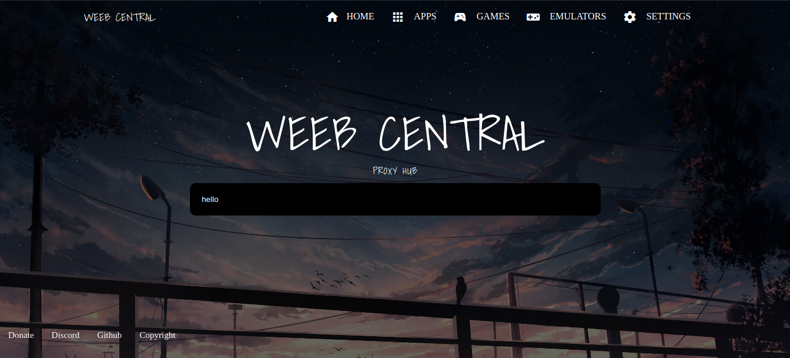

# WeebCentral (WC)
<a href="https://discord.gg/HUKuWtXwS5"> | Join Our Discord!</a>
<br>

Weeb Central is a proxy website that uses multiple backends. Such as:
- [Ultraviolet](https://github.com/titaniumnetwork-development/Ultraviolet)

And others coming soon (so I won't list them here)

Here is a preview of the website: 


## Self Hosting
---
### Requirements
- [Node.js](https://nodejs.org/en/)
- [Git](https://git-scm.com/downloads)
- [NPM](https://www.npmjs.com/get-npm) <br>
## Installation
- Clone the repository
```bash 
$ git clone https://github.com/weeb-network/wc.git
```
- Install the dependencies
```bash
$ npm install
```
- Start the server
```bash
$ npm start
```
- Open your browser and go to `localhost:8080`
## Alternatives for Hosting
### Docker Installation
#### Requirements
- Install docker and docker-compose (if you don't have it already) 
#### Installation
- Copy the docker compose example below and paste it into a file called `docker-compose.yml`
```yaml
version: "2"
services:
  wc:
    restart: unless-stopped
    image: "ghcr.io/weeb-network/wc:main"
    ports:
    #IMPORTANT: DO NOT CHANGE THE 8080 PART ONLY CHANGE THE <your port here> PART
      - <your port here>:8080

```
 - You can also just simply curl the docker-compose.yml file from github
 ```bash 
$ curl https://raw.githubusercontent.com/Weeb-Network/wc/main/docker-compose.yml > docker-compose.yml
```
- Change `<your port here>` to the port you want to use removing the `<>` around it.
- Run the docker-compose file
```bash
$ docker-compose up -d
```
#### Docker Only Installation
- Run the following command
```bash
$ docker run -d -p <your port here>:8080 --restart unless-stopped --name wc ghcr.io/weeb-network/wc:main 
```
- Change `<your port here>` to the port you want to use removing the `<>` around it.
---
## Contributing
Contributions are great and welcome! If you want to contribute, please read the [Contributing Guidelines](./.github/CONTRIBUTING.md) first.
## License
---
All code is licensed under the [GPL-3.0 License](./LICENSE.md) Unless otherwise stated.
# Icons credit
- Discord Logo at the top <br> 
<a target="_blank" href="https://icons8.com/icon/M725CLW4L7wE/discord-new">Discord New</a> icon by <a target="_blank" href="https://icons8.com">Icons8</a>


